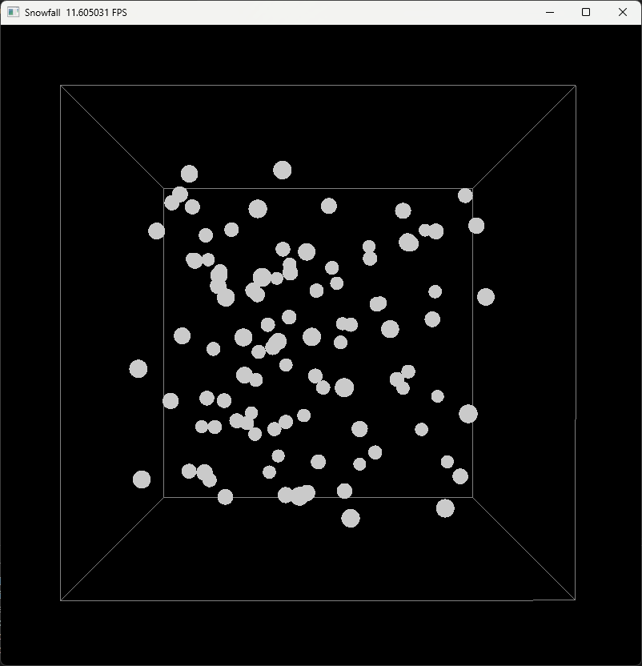
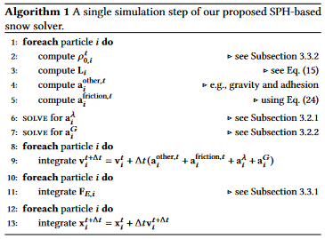

# SnowFall
- Run via
    ```
    python main.py
    ```

## Current Progress



for now, the snow particles can fall and collide with the floor of the domain. There are no forces calculated other than gravity.

last updated Nov 4th 2023

### Milestones
1. ~~Set up programming environment (including choice of language + libraries) (Oct 31 - Nov 7)~~
2. ~~Create simple render + viewport to enable visual debugging (Oct 31 - Nov 7)~~
3. Implement SPH to support minimal target (Nov 7th - 21st) 
4. Show compression of snow due to cube (Nov 21st - Nov 28th)
Midterm Presentation (28th Nov)
5. Implement adhesion and friction with cube (Nov 28th - Dec 5th)
6. Physics working with arbitrary mesh (Dec 5th - Dec 12th)
7. Rendering + Performance (Dec 12th - Dec 19th)
Deadline (Dec 19th)


## Architecture:
- **main.py**: entry point for program.
    - creates/reads configuration for simulation
    - creates particle system class
    - creates solver class
- **snow_config.py**: contains configuration parameters in a neat structure that can be passed around
- **particle_system.py**: contains class definition and methods for ParticleSystem:
    - contains necessary fields for particles (position, vel, accel) as [ti.Vector.field](https://docs.taichi-lang.org/docs/field#vector-fields) types that are (N,3) arrays where N is the number of particles
    - handles visualization of the domain and particles within
- **sph_solver.py**: provides a class that contains a handle on the ParticleSystem and defines simulation methods: "implements physics"
    - contains "step" method that updates the simulation
    - contains kernels used for sph

### Psuedocode for Simulation Step:


**from Gissler et al paper (An Implicit Compressible SPH Solver for Snow Simulation)**
pseudocode for a single simulation step in SPH snow solver:
```
foreach particle i do: (see self.compute_internal_forces)
    compute p_{0,i}^t (pressure force at time t, Section 3.3.2)
    compute L_t (correction matrix, Eq 15 in paper)
    compute a_{i}^{other,t} (acceleration due to gravity, adhesion, and ext forces)
    compute a_{i}^{friction,t} (accerleration due to friction and boundary, eq 24)
solve for a_i^lambda
solve for a_i^G
foreach particle i do
    integrate velocity v
foreach particle i do 
    integrate and store deformation gradient F
foreach particle i do
    integrate positison x (see self.update_position)
```
This pseudocode is already layed out in [SnowSolver.substep](sph_solver.py)
## To-Do/Next Steps:
- ~~implement smoothing kernel for SPH~~
- implement minimal target
    - compute pressure - Livio
    - compute correction matrix - Livio
    - compute a_other (ignoring boundary effects) - Livio
    - solver for elastic deformation - Jackson
        - solve a^lambda
        - solve a_G
    - integrate deformation gradient - Onat
- implement desired target
    - compute full a_other term
    - compute a_friction

## Sources
for theory:
- https://sph-tutorial.physics-simulation.org/
- https://matthias-research.github.io/pages/publications/sca03.pdf  


for implementation inspiration:
- https://github.com/erizmr/SPH_Taichi/tree/master
- https://github.com/pmocz/sph-python/blob/master/sph.py
